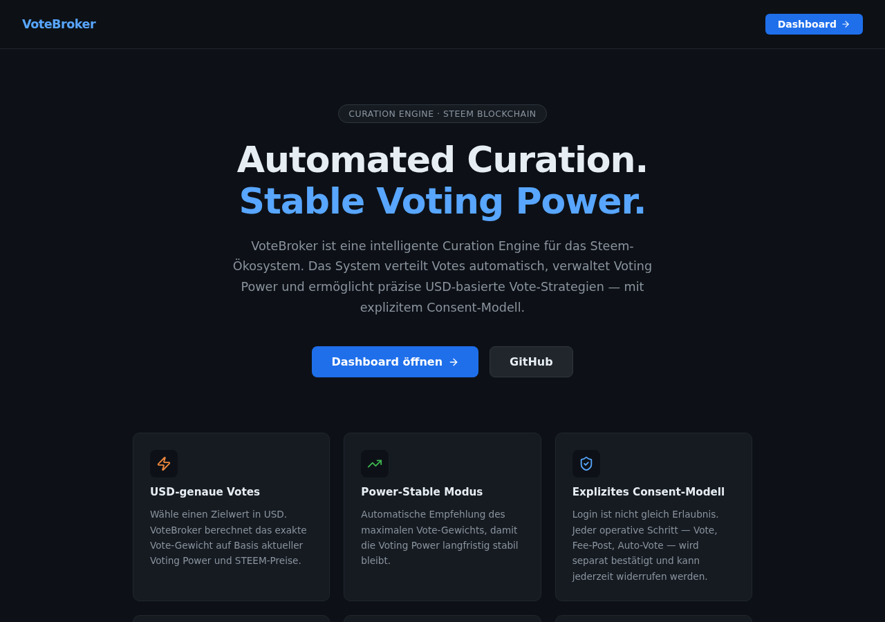
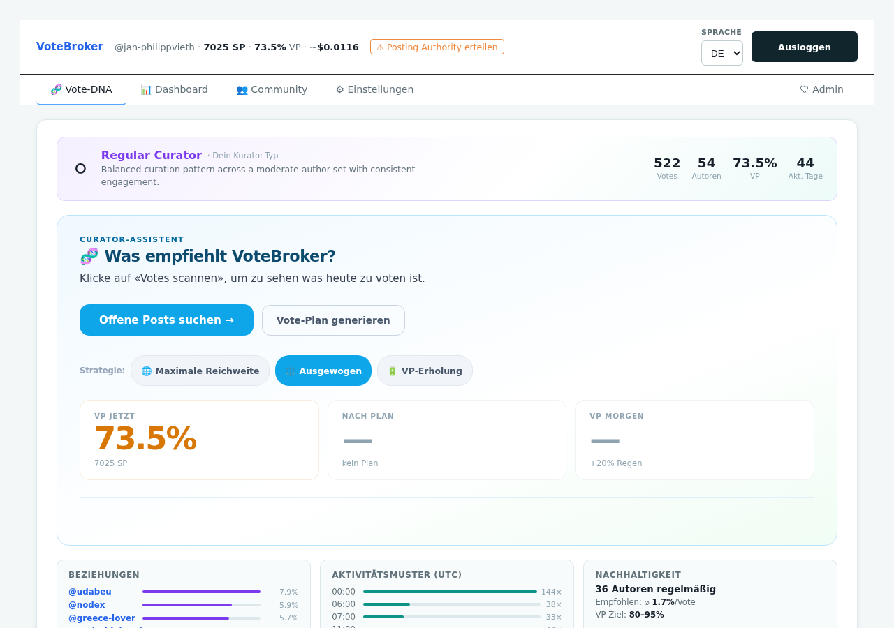
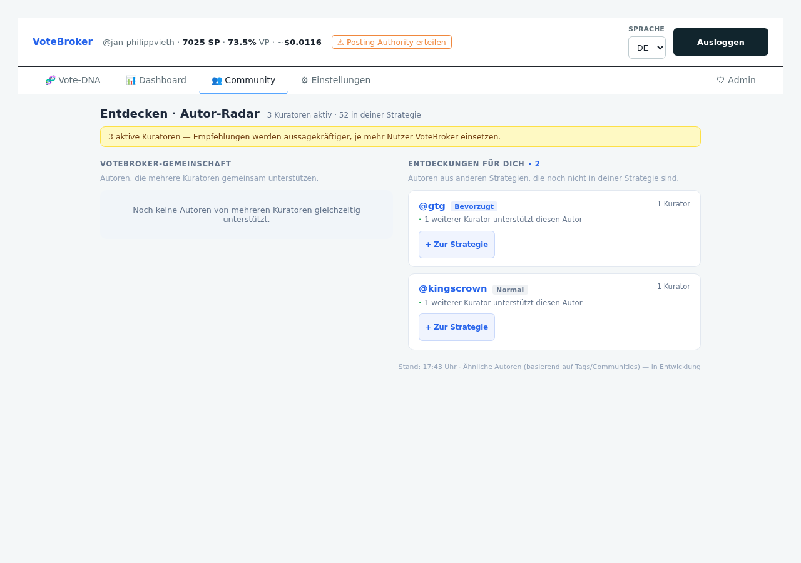
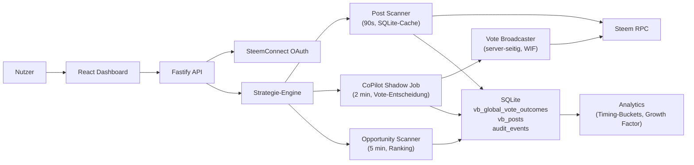

# VoteBroker

**Automatisierte Kuration auf Steem — präzise, transparent, datengetrieben.**

VoteBroker läuft auf einem eigenen VPS und übernimmt das Timing und die Ausführung deiner Votes. Du legst fest, welchen Autoren du folgen willst und welche Priorität sie haben. VoteBroker beobachtet neue Posts, berechnet den optimalen Votezeitpunkt aus echten historischen Daten und sendet den Vote — mit deiner delegierten Posting-Berechtigung, sicher server-seitig.

Live seit Mai 2026 auf [votebroker.org](https://votebroker.org).



---

## Für wen ist VoteBroker?

**Kuratoren**, die ihre Curation Rewards optimieren wollen, ohne jeden Post manuell timen zu müssen.

**Delegatoren**, die ihre SP effizient einsetzen und nachvollziehen wollen, wann, warum und wie stark ihr Vote gefeuert wurde.

**Witnesses und große Accounts**, die systematisch kuratieren und den eigenen Einfluss im richtigen Moment platzieren wollen.

**Entwickler**, die eine saubere, erweiterbare TypeScript-Architektur für Steem-Automatisierung suchen.

---

## Was VoteBroker heute kann

### Strategie-System
Jeder Nutzer pflegt eine eigene Liste von Autoren mit Kurations-Kategorien:

| Kategorie | Bedeutung |
|-----------|-----------|
| `immer voten` | Wird bei jedem neuen Post gevoted, höchste Priorität |
| `lieblingsautor` | Hohe Priorität, volle Aufmerksamkeit |
| `bevorzugt` | Reguläre Kuration mit Vorzugsbehandlung |
| `normal` | Standardkuration |
| `ignorieren` | Aus dem Scanner ausgeschlossen |

Jede Regel ist einzeln aktivierbar. Das System merkt sich, welche Regeln manuell bearbeitet wurden.

### CoPilot — Automatisches Vote-Timing
Der CoPilot scannt alle 2 Minuten neue Posts der strategierelevanten Autoren. Er vergleicht den aktuellen Post-Zeitpunkt mit historischen Timing-Buckets und feuert den Vote im nachweislich besten Fenster. Zu frühe Votes (unter 5 Minuten) werden automatisch ausgeschlossen — sie liefern für Nicht-Autoren keine Curation Rewards.

Jede Vote-Entscheidung — ob abgefeuert oder übersprungen — wird mit Begründung protokolliert.



### Opportunity Scanner
Neben der eigenen Strategie entdeckt VoteBroker laufend interessante Posts außerhalb der Autoren-Liste: nach Community, Timing-Muster und historischer Payout-Performance bewertet. Die Opportunities sind direkt im Dashboard votebar oder lassen sich mit einem Klick zur eigenen Strategie hinzufügen.



### Post Scanner
Ein zentraler Blockchain-Adapter lädt alle 90 Sekunden neue Posts aller überwachten Autoren aus der Steem-Chain und schreibt sie lokal in SQLite. Alle nachgelagerten Scanner lesen aus diesem Cache statt direkt per RPC — das reduziert Latenz und Blockchain-Last erheblich.

### Vote Analytics
Jeder ausgeführte Vote wird mit Delay, Gewicht, Pending Payout und Final Payout gespeichert. Das System berechnet daraus:
- Timing-Bucket-Performance (5–30 min, 30–120 min, 2–6 h, …)
- Growth Factor (wie stark wächst ein Post nach dem Vote)
- SP-pro-VP-Effizienz der beobachteten Autoren

Diese Daten fließen direkt in das Vote-Timing zurück.

### Admin Panel
Ein geschütztes Admin-Interface zeigt in Echtzeit:
- **System**: CPU-Auslastung, RAM-Verbrauch, Uptime, Node-Version
- **Scanner**: Letzte Laufdauer und Zeitpunkt für Post-, Shadow- und Opportunity-Scanner
- **Blockchain**: RPC-Calls/min, Cache-Trefferquote, Ø Cache-Alter
- **Daten**: Anzahl Autoren, Posts, Eligible Posts, Would-Votes (letzter Tag)

### Transparente Abrechnung
Plattformgebühren werden nicht per Überweisung, sondern durch einen automatischen Vote auf einen öffentlichen Fee-Post beglichen. Jeder kann den Fee-Vote on-chain nachvollziehen. Die Abrechnung erfolgt erst nach expliziter Zustimmung des Nutzers.

---

## Wie es funktioniert

```
Steem Chain
    │
    ▼
Post Scanner (90s)
    │   schreibt vb_posts, wärmt Cache
    ▼
CoPilot Shadow Job (2 min)
    │   liest Cache → bewertet Timing → feuert Vote
    ▼
Vote Broadcaster (server-seitig, delegierter WIF)
    │
    ▼
Steem Chain (on-chain Vote)
    │
    ▼
vb_global_vote_outcomes (nach Payout)
    │
    ▼
Analytics → verbesserte Timing-Empfehlungen
```

---

## Technischer Stack

| Schicht | Technologie |
|---------|-------------|
| Sprache | TypeScript |
| Runtime | Node.js 20+ |
| API | Fastify, Zod |
| Frontend | React, Vite |
| Datenbank | SQLite (better-sqlite3, persistent) |
| Blockchain | dsteem / beem |
| Auth | SteemConnect OAuth 2 (Code-Flow, server-seitig) |
| Deployment | Docker Compose + Caddy (automatisches HTTPS) |

---

## Deployment

```bash
cp .env.production.example .env
# Werte eintragen (Posting-WIF, SteemConnect-Secret, Operator-Token)
docker compose -f docker-compose.prod.yml up -d --build
```

Der Stack bringt Caddy mit — HTTPS für `votebroker.org` wird automatisch provisioniert, sobald DNS auf den Server zeigt. Details in [Deployment](DEPLOYMENT.md).

Lokale Entwicklung:

```bash
npm run dev:api   # API auf http://localhost:3000
npm run dev:web   # Web auf http://localhost:5173
```

---

## Sicherheitsmodell

- Private Keys verlassen niemals den Browser. VoteBroker arbeitet ausschließlich mit einer delegierten Posting-Berechtigung, die der Nutzer in SteemConnect erteilt.
- Votes auf den Fee-Post werden nur nach expliziter `fee_post_vote`-Zustimmung ausgeführt.
- Jede Consent-Änderung wird in der Consent-Historie gespeichert.
- Das Admin-Interface ist durch einen separaten Operator-Token geschützt.

Siehe [Consent Model](docs/CONSENT_MODEL.md) und [Security Notes](docs/SECURITY.md).

---

## Architektur-Überblick



Die Domain-Schicht (`packages/domain`) enthält die gesamte Business-Logik — Vote-Mathematik, Billing-Zustände, Timing-Empfehlungen — ohne HTTP-, Datenbank- oder Blockchain-Abhängigkeiten. Sie ist unabhängig testbar und austauschbar.

---

## Dokumentation

- [Architektur](docs/ARCHITECTURE.md)
- [Billing-Modell](docs/BILLING_MODEL.md)
- [Consent-Modell](docs/CONSENT_MODEL.md)
- [Deployment](DEPLOYMENT.md)
- [Security](docs/SECURITY.md)
- [Architecture Decision Records](docs/decisions/)
- [Engineering Devlog](docs/devlog/)
