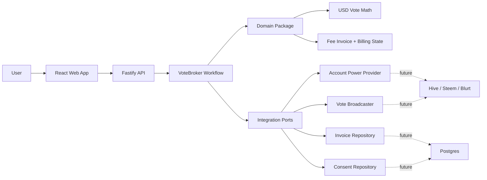

# VoteBroker Modern

VoteBroker Modern is a TypeScript reference architecture for USD-targeted social blockchain voting.

Instead of asking users to choose an abstract vote percentage, VoteBroker lets them choose the desired USD value of a vote. The system estimates the required vote weight, creates a fee invoice, and settles that fee through an automated vote on a transparent fee post. The result is a payment flow where users do not transfer money directly; they pay with voting power.

This repository is structured as a portfolio-grade example of modern TypeScript architecture: domain-first business rules, explicit service boundaries, a typed API layer, and a focused React interface.


## Highlights

- **USD-targeted voting**: users enter a desired vote value such as `$2.50`; the system calculates the required vote weight.
- **Vote-funded billing**: platform fees are settled through an automated vote on a configured fee post.
- **Explicit consent layer**: SteemConnect login does not silently authorize fee-post votes.
- **Domain-first architecture**: core business rules live in a framework-independent package.
- **Typed API surface**: Fastify + Zod validate requests before calling workflows.
- **Modern frontend**: Vite + React UI for the main quote workflow.
- **Explicit integration ports**: blockchain, pricing, invoices, and consent can be replaced independently.
- **Tested core logic**: unit tests cover USD quote calculation and billing state transitions.

## Product Model

VoteBroker has two coordinated vote flows:

1. **Post vote**: the user chooses how much USD value they want to give to a target post.
2. **Fee-post vote**: VoteBroker calculates its fee and settles it by casting a second vote from the user to a designated fee post.

If voting power is too low to settle fees over time, the account moves through billing states:

- `active`: account can use automated voting
- `warning`: fee votes have been underfunded repeatedly
- `paused`: new automated post votes are stopped until voting power recovers
- `payment_required`: manual unlock or payment is required

## Architecture



## Workspace Layout

```text
VoteBroker_modern/
  apps/
    api/              Fastify API and workflow orchestration
    web/              React/Vite user interface
  packages/
    domain/           Pure TypeScript domain logic
  docs/
    ARCHITECTURE.md   Technical architecture notes
    BILLING_MODEL.md  Vote-funded billing model
    MIGRATION.md      Migration plan from the legacy project
```

## Tech Stack

- **Language**: TypeScript
- **Runtime**: Node.js 20+
- **API**: Fastify, Zod
- **Frontend**: React, Vite, lucide-react
- **Testing**: Node test runner
- **Build**: npm workspaces, TypeScript compiler, Vite

## Setup

```bash
npm install
npm run build
npm test
```

## Docker Deployment

```bash
docker compose up -d --build
```

The web container serves the React app and proxies `/api` to the Fastify service. Production notes for `votebroker.org` live in [Deployment](docs/DEPLOYMENT.md).

Start the API:

```bash
npm run dev:api
```

Start the web app:

```bash
npm run dev:web
```

Default local URLs:

- API: `http://localhost:3000`
- Web: `http://localhost:5173`
- Production preview: `npm run preview -w @votebroker/web`

## Environment

Copy `.env.example` and adjust values as needed.

```env
PORT=3000
HOST=0.0.0.0
VOTEBROKER_FEE_BPS=300
VOTEBROKER_MIN_FEE_USD=0.05
VOTEBROKER_FEE_POST_AUTHOR=votebroker
VOTEBROKER_FEE_POST_PERMLINK=monthly-fees
VOTEBROKER_WARNING_AFTER_FAILURES=2
VOTEBROKER_PAUSE_AFTER_FAILURES=4
VITE_API_BASE=http://localhost:3000
STEEMCONNECT_HOST=https://api.steemconnect.com
STEEMCONNECT_CLIENT_ID=votebroker
STEEMCONNECT_CLIENT_SECRET=
STEEMCONNECT_REDIRECT_URI=http://localhost:5173/auth/callback
STEEMCONNECT_SCOPES=login,vote
```

## API Examples

### Health Check

```bash
curl http://localhost:3000/health
```

Response:

```json
{
  "status": "ok",
  "service": "votebroker-api"
}
```

### SteemConnect Login URL

```bash
curl http://localhost:3000/api/auth/steemconnect/url
```

Response:

```json
{
  "url": "https://api.steemconnect.com/oauth2/authorize?client_id=votebroker&..."
}
```

## Consent Model

VoteBroker treats SteemConnect permissions as technical capability, not as blanket product consent.

The user must separately confirm:

- `login`: local VoteBroker session and identity
- `target_vote`: user-requested post votes
- `fee_post_vote`: transparent service-fee votes on the configured fee post
- `auto_vote`: optional automation under user-defined limits

Every consent can be revoked and every change is written to consent history. Fee-post settlement is blocked unless `fee_post_vote` consent is active.

See [Consent Model](docs/CONSENT_MODEL.md).

After SteemConnect redirects back with a `code`, exchange it for a local VoteBroker session:

```bash
curl -X POST http://localhost:3000/api/auth/steemconnect/callback \
  -H "Content-Type: application/json" \
  -d '{
    "code": "steemconnect-code"
  }'
```

Response:

```json
{
  "token": "local-session-token",
  "expiry": "2026-05-28T10:00:00.000Z",
  "user": {
    "username": "demo",
    "provider": "steemconnect"
  }
}
```

### Quote A USD Vote

```bash
curl -X POST http://localhost:3000/api/votes/quote \
  -H "Content-Type: application/json" \
  -d '{
    "username": "demo",
    "author": "alice",
    "permlink": "example-post",
    "desiredVoteUsd": 2.5
  }'
```

Example response:

```json
{
  "account": {
    "username": "demo",
    "votingPowerBps": 8000,
    "fullPowerVoteUsd": 10,
    "status": "active",
    "consecutiveUnderfundedFees": 0
  },
  "quote": {
    "author": "alice",
    "permlink": "example-post",
    "desiredVoteUsd": 2.5,
    "expectedVoteUsd": 2.5,
    "voteWeightBps": 3125,
    "capped": false,
    "warnings": []
  },
  "feeInvoice": {
    "amountUsd": 0.08,
    "feePostAuthor": "votebroker",
    "feePostPermlink": "monthly-fees",
    "requiredVoteWeightBps": 94,
    "status": "open"
  }
}
```

### Settle A Fee Invoice

```bash
curl -X POST http://localhost:3000/api/fees/settle \
  -H "Content-Type: application/json" \
  -d '{
    "invoiceId": "fee-invoice-id"
  }'
```

This endpoint currently simulates settlement against the in-memory account snapshot. In production it should verify the actual chain transaction before marking an invoice as settled.

## Domain Example

The core business logic can be used without Fastify, React, or a database:

```ts
import { quoteUsdVote } from "@votebroker/domain";

const quote = quoteUsdVote({
  author: "alice",
  permlink: "example-post",
  desiredVoteUsd: 2.5,
  account: {
    username: "demo",
    votingPowerBps: 8000,
    fullPowerVoteUsd: 10,
    status: "active",
    consecutiveUnderfundedFees: 0
  }
});

console.log(quote.voteWeightBps); // 3125 = 31.25%
```

## Test Status

Current local verification:

```text
npm run typecheck  PASS
npm run build      PASS
npm test           PASS
```

Covered domain behavior:

- USD vote quote calculation
- fee invoice calculation
- account pause state after repeated underfunded fee votes

## Design Principles

- **Business logic is portable**: calculations and billing transitions are plain TypeScript.
- **Infrastructure is replaceable**: chain access, persistence, consent, and broadcasting sit behind ports.
- **User intent is explicit**: the UI models desired USD value instead of exposing raw vote weight first.
- **Billing is auditable**: fee-post settlement creates a visible on-chain payment trail.
- **Failure states are productized**: low voting power becomes warning, pause, and unlock states rather than hidden errors.

## Current Limitations

- Account power, vote value, and invoices are mocked in memory.
- Fee settlement is estimated, not verified against real blockchain transactions.
- Consent storage for automated fee-post votes is represented as a port but not implemented.
- The current UI is a focused workflow prototype, not a complete dashboard.
- Security, rate limiting, authentication, and production observability still need to be added.

## Roadmap

### Phase 1: Production Adapters

- Implement Hive/Steem/Blurt account power provider.
- Implement live price/reward-fund provider.
- Implement vote broadcaster for post votes and fee-post votes.
- Verify real chain transactions before settlement.

### Phase 2: Persistence And Auth

- Add Postgres invoice repository.
- Store account billing status and failure counters.
- Add user authentication and signed consent for automated fee-post votes.
- Add audit log for every vote, invoice, and settlement attempt.

### Phase 3: Product UX

- Add account dashboard.
- Add fee-post transparency page.
- Add warnings for low voting power before automation fails.
- Add admin unlock and manual payment workflow.

### Phase 4: Operations

- Add CI pipeline.
- Add Docker image and deployment configuration.
- Add structured logging, metrics, and alerting.
- Add integration tests with mocked chain adapters.

## Related Documentation

- [Architecture](docs/ARCHITECTURE.md)
- [Billing Model](docs/BILLING_MODEL.md)
- [Consent Model](docs/CONSENT_MODEL.md)
- [Deployment](docs/DEPLOYMENT.md)
- [Migration Notes](docs/MIGRATION.md)

## Portfolio Note

This project is intentionally structured to demonstrate modern backend design more than raw feature volume: domain isolation, typed boundaries, testable business rules, and clear migration paths from legacy code to a maintainable service architecture.
