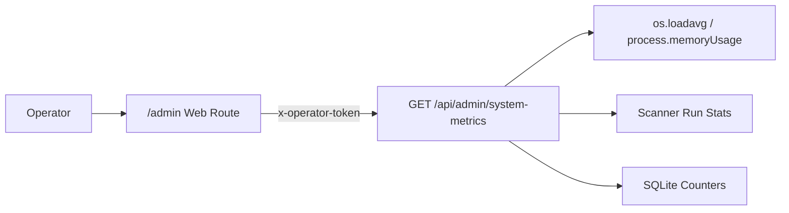

# Architecture

VoteBroker separates business rules from transport, storage, and blockchain adapters.

## Layers

### Domain (`packages/domain`)

Pure TypeScript logic with no HTTP, database, or chain dependencies:

- quote a target USD vote into a vote weight
- recommend fixed or automatic vote timing
- calculate the fee invoice
- select fair-use billing modes and transparency messages
- assess whether the automated fee-post vote can settle the invoice
- move accounts through `active`, `warning`, `paused`, and `payment_required`

### API (`apps/api`)

Fastify server exposing the domain as HTTP endpoints, plus a background job scheduler.

**HTTP endpoints** (selection):

| Method | Path | Description |
|--------|------|-------------|
| `GET` | `/health` | Service health check |
| `GET` | `/api/auth/steemconnect/url` | SteemConnect login URL |
| `POST` | `/api/auth/steemconnect/callback` | OAuth code exchange |
| `GET` | `/api/strategy` | Read user strategy rules |
| `POST` | `/api/strategy` | Save user strategy rules |
| `GET` | `/api/opportunities` | Ranked post opportunities |
| `POST` | `/api/votes/execute` | Broadcast a vote server-side |
| `POST` | `/api/votes/quote` | USD vote quote + fee invoice |
| `GET` | `/api/admin/system-metrics` | Runtime system metrics (operator) |

**Background jobs**:

| Job | Interval | Description |
|-----|----------|-------------|
| Post Scanner | 90 s | Fetches recent posts for all tracked authors from Steem RPC, writes to `vb_posts`, warms in-memory post cache |
| CoPilot Shadow Job | 2 min | Evaluates strategy rules against cached posts, fires votes at optimal timing, records decisions in `audit_events` |
| Opportunity Scanner | 5 min | Scores posts from non-strategy authors, writes ranked list to `vb_opportunities` |
| Payout Sync | nightly | Reads settled payouts from chain, updates `vb_global_vote_outcomes` with final payout and growth factor |
| Signal Compute | nightly 02:30 UTC | Aggregates author and community signals from enriched whale vote data |

### Web (`apps/web`)

React/Vite dashboard with:

- **Vote-DNA tab**: CoPilot interface, strategy management, vote history
- **Dashboard tab**: Pending/realized/forecast payout analytics, timing bucket charts, growth factor trends
- **Opportunities tab**: Ranked post discovery, inline vote and strategy-add actions
- **Community tab**: Autor-Radar, shared author discovery across VoteBroker users
- **Einstellungen tab**: Account settings, timezone, vote weight targets
- **Admin tab**: System metrics, scanner status, database counters (operator only)

## Data model

**Core tables** (SQLite, persistent):

| Table | Purpose |
|-------|---------|
| `user_sessions` | SteemConnect OAuth sessions |
| `user_settings` | Per-user preferences (timezone, weight targets) |
| `strategy_rules` | Per-user author strategy entries |
| `vb_posts` | Post cache written by Post Scanner |
| `vb_post_scan_log` | Last scan timestamp per author |
| `vb_global_vote_outcomes` | Vote history with delay, payout, growth factor |
| `vb_opportunities` | Ranked opportunity posts |
| `audit_events` | Every vote, skip, fee, and consent event |
| `vb_signal_author` | Nightly-computed per-author curation signals |
| `vb_signal_community` | Nightly-computed per-community signals |

## Adapter boundaries

Production integrations sit behind interfaces:

- `PriceProvider`: token and reward-fund prices
- `AccountPowerProvider`: current voting power and full-power vote value
- `VoteBroadcaster`: submit votes (live: server-side WIF via dsteem)
- `InvoiceRepository`: persist invoices and status changes
- `ConsentRepository`: store user authorization for automated fee-post votes

## Read priority in the scanner chain

Post data flows through three tiers to minimize RPC calls:

```
1. In-memory post cache (150 s TTL) — fastest
2. SQLite vb_posts (≤5 min staleness) — warms cache on hit
3. Steem RPC — last resort, also warms cache and DB
```

The Post Scanner runs every 90 seconds and keeps tiers 1 and 2 warm, so downstream scanners (CoPilot, Opportunity) almost never need to hit RPC directly.

## Operator flow



The admin route is protected by `VOTEBROKER_OPERATOR_TOKEN`. Add reverse proxy rules and stronger authentication before exposing the service publicly.
