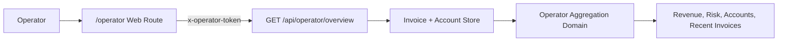

# Architecture

VoteBroker Modern separates business rules from transport, storage, and blockchain adapters.

## Layers

### Domain

`packages/domain` contains pure TypeScript logic:

- quote a target USD vote into a vote weight
- recommend fixed or automatic vote timing
- calculate the fee invoice
- select fair-use billing modes and transparency messages
- assess whether the automated fee-post vote can settle the invoice
- aggregate internal operator revenue and invoice state
- move accounts through `active`, `warning`, `paused`, and `payment_required`

This package should stay free of HTTP, database, and chain dependencies.

### API

`apps/api` exposes the domain as HTTP endpoints.

- `POST /api/votes/quote`: creates a post-vote quote and fee invoice
- `POST /api/fees/settle`: assesses the fee-post vote settlement
- `GET /api/operator/overview`: returns token-protected internal revenue and invoice aggregates
- `GET /health`: service health check

The current store is intentionally in-memory. Replace it with Postgres repositories before production use.

The operator endpoint is intentionally protected by `VOTEBROKER_OPERATOR_TOKEN`. It reads from the same invoice and account stores as the normal workflow and does not fabricate demo revenue. If no invoices exist yet, values are zero and lists are empty.

### Web

`apps/web` is a focused React interface for the main workflow:

1. user enters account, post, and desired USD vote value
2. user selects manual vote timing or Auto Timing
3. system calculates the vote weight
4. system shows the fee invoice, fair-use billing mode, and required fee-post vote if applicable
5. warnings show when the target vote is not currently possible

The internal operator dashboard is mounted at `/operator`. It requires the operator token and displays real runtime aggregates such as settled fees, pending fees, waived fair-use value, donation opportunity, curation moved, billing mode counts, top accounts, and recent invoices.

## Adapter Boundaries

Production integrations should live behind interfaces:

- `PriceProvider`: token and reward-fund prices
- `AccountPowerProvider`: current voting power and estimated full-power vote value
- `VoteBroadcaster`: submit post votes and fee-post votes
- `InvoiceRepository`: persist invoices and status changes
- `ConsentRepository`: store user authorization for automated fee-post votes
- `OperatorOverview`: aggregate internal revenue and risk metrics from persisted invoice/account state

Keeping these boundaries small avoids repeating the old coupling between routes, DB entities, and bot code.

## Internal Operator Flow

The operator route should remain internal-only in production deployments. The token protects the API endpoint, but reverse proxy rules, logging hygiene, and stronger operator authentication should be added before exposing the service publicly.
